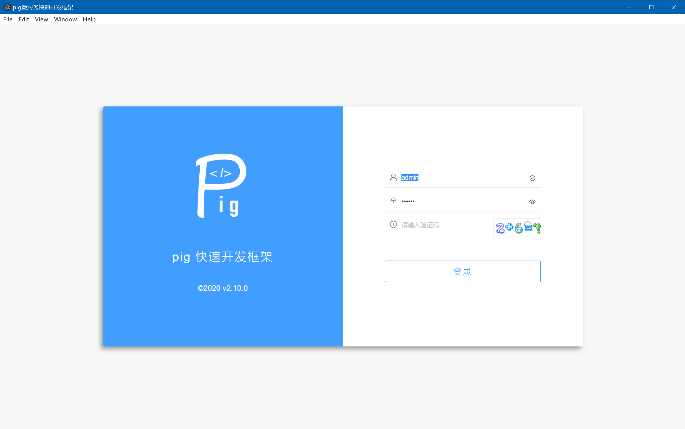
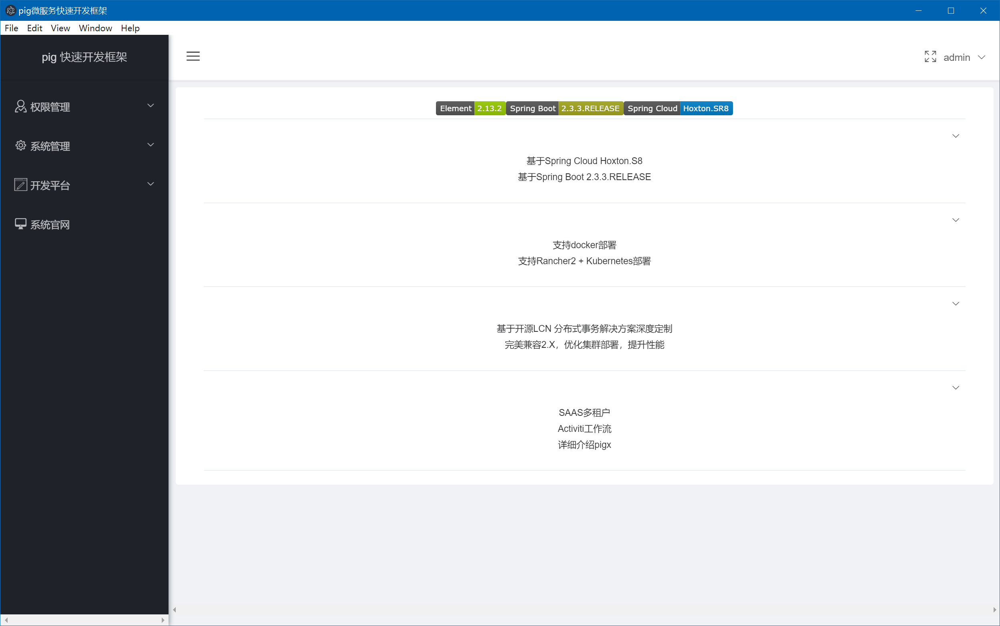
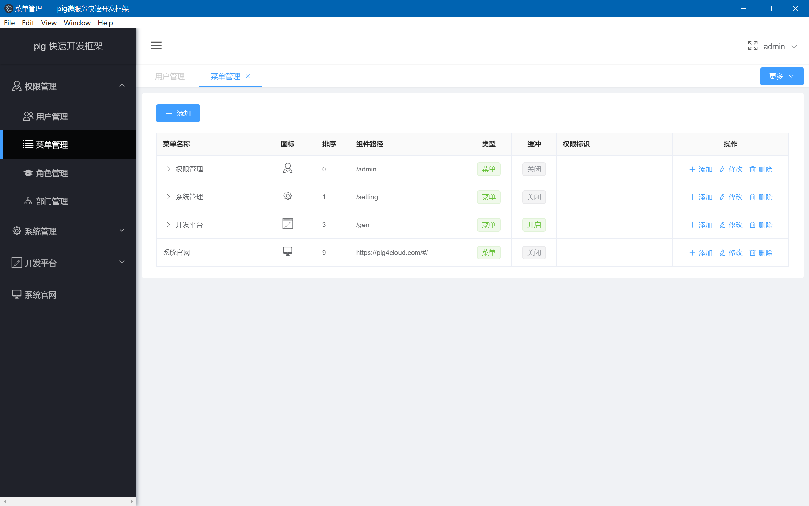

## pig-ui electron 版本

此项目是 [pig-ui](https://github.com/pig-mesh/pig-ui) 的`electron`移植版


### 开发环境

安装依赖

```shell script
yarn
```
或者
```shell script
npm i
```

修改`.env.development`文件中的`VUE_APP_API_URL`参数，它表示后端服务的地址。然后可以跑起来了:

```shell script
yarn electron:dev
```

> 启动过程可能有点慢,需要等一会。


### 打包

打包预设了3种环境:

- 集成测试 `prod:sit`
- 验收测试 `prod:uat`
- 生产环境 `prod`

对应的配置文件`.env.development.sit`、.env.development.uat`、.env.development`，你需要修改里面的`VUE_APP_API_URL`参数，填上服务端地址。

根据你的需要进行打包:

```shell script
yarn electron:build:sit
yarn electron:build:uat
yarn electron:build:prod
```


### 效果演示





